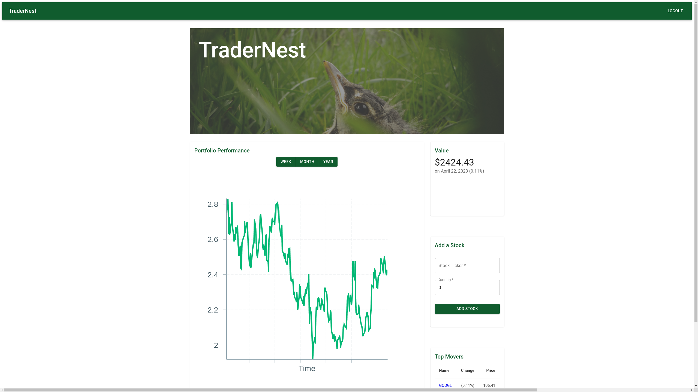
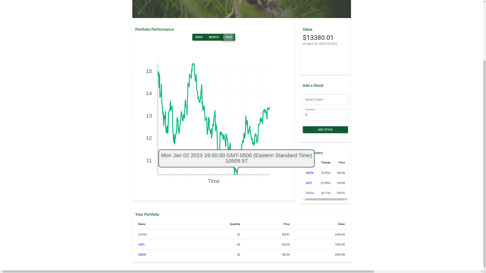
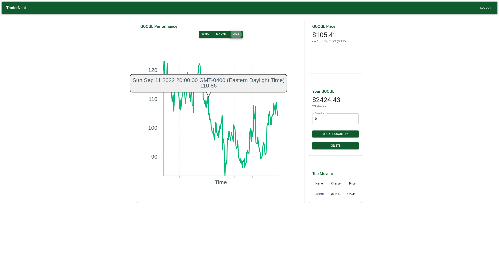

# TraderNest
TraderNest is a web application created using the MERN stack to keep track of different stock holdings you may own or want to monitor. The application uses the FinnHub API to gather financial information about each stock that has been added, and its historical price is visualized by a Victory graph over the time spans of a week, month, or year.

## UPDATE
The API used to gather stock information has been changed from Finnhub to TwelveData, since one of the functionalities used to create the price graphs have been paywalled.

## Features

-   User authentication system: register and log in to your account
-   Portfolio management: add, update, and delete stocks in your portfolio
-   Financial data: retrieve and display financial information about each stock using the FinnHub API
-   Interactive data visualization: view historical price data in a Victory graph

## Getting Started

To get started with TraderNest, follow these steps:

1.  Visit [trader-nest.netlify.app](https://trader-nest.netlify.app/) to access the live version of the app.
2.  Create an account by registering for a new account.
3.  Log in to your account.
4.  Add a stock to your portfolio by entering the stock ticker and quantity.

### Deployment

TraderNest is live at [trader-nest.netlify.app](https://trader-nest.netlify.app/)

## Technologies used

-   [Typescript](https://www.typescriptlang.org/) - a superset of JavaScript that adds optional static typing
-   [Node.js](https://nodejs.org/en/) - a JavaScript runtime built on Chrome's V8 JavaScript engine
-   [MaterialUI](https://material-ui.com/) - a React UI framework based on Google's Material Design principles
-   [Finnhub API](https://finnhub.io/) - a financial data platform providing real-time and historical stock data
-   [Axios](https://github.com/axios/axios) - a promise-based HTTP client for making API requests
-   [JsonWebtoken](https://jwt.io/) - a JSON-based open standard for creating access tokens that can be used for authorization
-   [React](https://reactjs.org/) - a JavaScript library for building user interfaces
-   [Victory](https://formidable.com/open-source/victory/) - a collection of composable React components for creating data visualizations
-   [Zustand](https://github.com/pmndrs/zustand) - a small, fast and scalable state management library for React
-   [Express](https://expressjs.com/) - a web framework for Node.js that provides a set of features for building web applications and APIs
-   [Bcrypt](https://github.com/kelektiv/node.bcrypt.js/) - a library for hashing passwords using bcrypt algorithm
-   [MongoDB](https://www.mongodb.com/) - a NoSQL document database that provides high scalability, flexibility, and performance for handling large amounts of data.

## Routes

### Stock Routes
| Route | URL Path | HTTP Method | Purpose |
|--|--| --| --|
| Index | /stocks | GET | Display all of user's portfolio | 
| Create | /stocks | POST | Add a new stock in portfolio |
| Delete | /stocks/:id | DELETE | Delete a stock in portfolio |
| Update | /stocks/:id | PUT | Updates stock quantity in portfolio |

### User Routes
| Route | URL Path | HTTP Method | Purpose |
|--|--| --| --|
| Sign up | /users/signup | POST | Create an account | 
| Login | /users/login | POST | Login to account |

## Screenshots
### Login

### Home

### Stock Table

### Stock Page

## Authors

- **Matthew Kolden** - _Initial work_ - [matthewkolden](https://github.com/matthewkolden)
